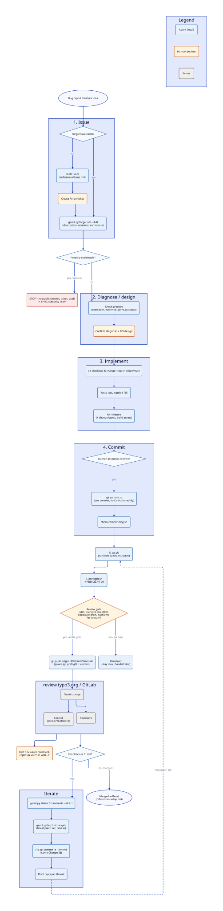

# typo3-contributor

[](https://github.com/dkd-dobberkau/typo3-contributor-skill/actions/workflows/ci.yml)

A Claude Code skill for contributing to TYPO3 Core with an AI agent under human supervision.
It follows the official
[TYPO3 Contribution Workflow Guide](https://docs.typo3.org/m/typo3/guide-contributionworkflow/main/en-us/)
and corrects the places where the guide is outdated against current `main`.

**Principle:** AI may contribute; a human supervises. The agent prepares commits, checks and texts locally.
The human reviews every diff, decides every push, and posts all comments, votes and Forge tickets.

## Covers

- Setup check of a Core checkout (pushurl from `~/.ssh/config`, hooks, commit template)
- Bugfix and feature patches: diagnose → test → implement → QA → commit → pre-push gate → push
- Iterating on reviewer and Core CI feedback (amend, same Change-Id)
- Deprecations, breaking changes, changelog rst, Extension Scanner matchers
- Reviewing and testing other people's changes
- Documentation-only patches and Forge issue drafts
- Optional [git-ai](https://usegitai.com) line-level attribution to focus human review and quantify AI disclosure

## Workflow

Blue steps are done by the agent locally, orange ones are decided by the human, grey ones happen on the servers.



Source: [`docs/contribution-workflow.d2`](docs/contribution-workflow.d2), rendered with
`d2 docs/contribution-workflow.d2 docs/contribution-workflow.svg`.

Questions? See the [FAQ](docs/FAQ.md).

## Scripts

| Script | Purpose |
|---|---|
| `scripts/quickstart-check.sh [--online]` | check the guide's Quickstart steps 1-5 (tools, accounts, Git, DDEV, TYPO3) |
| `scripts/check-setup.sh [--fix] [--online]` | verify/complete the contribution checkout |
| `scripts/qa.sh [--dry-run] [--fix]` | run the `runTests.sh` suites matching the HEAD commit |
| `scripts/check-commit-msg.sh [file]` | lint a commit message (stricter than the Core hook, which does not block) |
| `scripts/preflight.sh` | pre-push gate |
| `scripts/fix-trailer-order.sh` | move Change-Id last after `git commit --amend -s` |
| `scripts/gerrit.py status\|comments\|ci\|fetch\|files\|diff <change>`, `forge <issue> [--full]`, `branches`, `chain <sha>…` | read-only Gerrit / Core CI / Forge state |

## Install

### As a Claude Code plugin (recommended)

```bash
claude plugin marketplace add dkd-dobberkau/typo3-contributor-skill
claude plugin install typo3-contributor@typo3-contributor
```

Inside a session: `/plugin marketplace add dkd-dobberkau/typo3-contributor-skill`, then
`/plugin install typo3-contributor@typo3-contributor`. The skill appears as
`typo3-contributor:typo3-contributor`. Update with `claude plugin marketplace update typo3-contributor`.

### As a personal skill (symlink)

```bash
git clone https://github.com/dkd-dobberkau/typo3-contributor-skill.git
ln -s "$PWD/typo3-contributor-skill" ~/.claude/skills/typo3-contributor
```

Use one of the two ways, not both, or the skill is listed twice.

Requirements: git, bash, python3, Docker or Podman, a typo3.org account with an SSH key in Gerrit.

### Configuration (plugin)

```bash
claude plugin configure typo3-contributor@typo3-contributor
```

| Option | Default | Effect |
|---|---|---|
| `container_runtime` | `docker` | `runTests.sh -b docker\|podman` in all scripts (exported as `TYPO3_CONTRIB_RUNTIME`) |
| `core_dir` | `~/work/TYPO3-Contribute` | location of the `typo3/typo3` checkout (exported as `TYPO3_CORE_DIR`) |

As a personal skill, set `TYPO3_CONTRIB_RUNTIME` / `TYPO3_CORE_DIR` in your shell instead.

### Guard hooks (plugin)

The plugin ships a `PreToolUse` hook that turns the skill's rules into hard checks for the agent:
- a push to `review.typo3.org` is denied unless `preflight.sh` passes, and otherwise needs your confirmation;
- `gerrit review`/`abandon`/`submit` and Gerrit REST writes are always denied;
- `Co-Authored-By` in commits inside the Core checkout is denied.

Other repositories and commands are not affected.

## Tests

```bash
bash tests/run.sh
```

### Behaviour evals

`evals/` holds `claude plugin eval` cases built from real failures of agents without the skill
(guessed fetch source, removed suites, pushing without review, voting via ssh, backporting a deprecation).
Each case runs with and without the plugin and reports the difference:

```bash
claude plugin eval . --runs 2 --max-cost-usd 10
```

A full run costs about $2. In CI the `Evals` workflow runs on demand only (Actions → Evals → Run workflow)
and needs an `ANTHROPIC_API_KEY` repository secret.

`tests/baselines.md` documents agent behaviour without the skill and the guide corrections, which were verified against Core `main`.
`tests/fixtures/gerrit/` contains anonymized real API responses.

## Where the guide is outdated (as of 2026-10)

- `runTests.sh -s acceptance` no longer exists; end-to-end tests are `-s e2e` (Playwright).
- The `commit-msg` hook reports errors but does not block the commit.
- `FullyScanned`/`PartiallyScanned`/`NotScanned` are required only for Breaking/Deprecation changelog files.
- The optional `pre-commit` hook runs php-cs-fixer with the host PHP and fails when that is older than Core requires.

Inside the Core checkout, the Core team's `AGENTS.md` is authoritative; this skill follows it and adds human supervision.

## License

GPL-2.0-or-later, like TYPO3 Core. See `LICENSE`.
